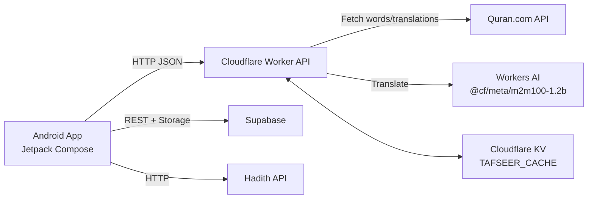

# AyahVerse Quran

## Overview
Android Quran app (Jetpack Compose) with helpers like word-by-word data, translations/tafseer, and tajweed practice.
Includes a Cloudflare Worker backend that fetches Quran.com data and performs cached machine translation for long text.

## Tech Stack
- Android: Kotlin, Jetpack Compose (Material 3), Coroutines
- Networking: Retrofit + OkHttp
- Local storage/cache: Room
- Media/UI: Coil (images), Jsoup (HTML parsing/sanitization)
- Offline speech recognition (tajweed practice MVP): Vosk
- Backend: Cloudflare Workers (TypeScript), Workers AI (`@cf/meta/m2m100-1.2b`), KV (cache)
- Tooling: Gradle Kotlin DSL, Wrangler, Vitest

## Features
- Supabase REST + Storage integration (configurable URL/keys/bucket for word images)
- Verse words endpoint backed by Quran.com (`/ayah-words?verse_key=2:255`)
- Verse translation fetch + KV caching (`/verse-translation?verse_key=2:255&translation_id=131`)
- Long-text translation with chunking + KV caching (`POST /translate`)
- Tafseer translation endpoint (`/?surah=1&ayah=1&ids=...&meaning_lang=en`) using Workers AI + KV cache (note: Arabic source text is currently stubbed in code)
- Hadith API support (API key + base URL configurable)
- Offline tajweed practice MVP using on-device speech recognition
- Room database for local caching (tafsir sources + cache)

## Demo
No public live demo link yet.

## Architecture

